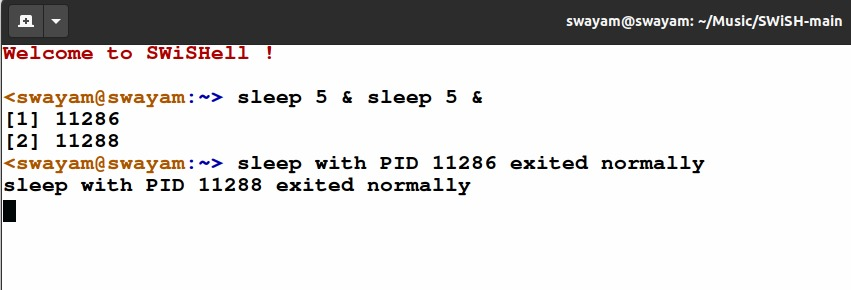
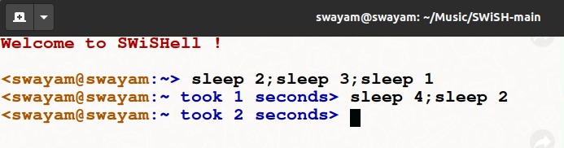

<!-- file is written in markdown format -->

```
Welcome to SWiSH
Basic Linux Styled C-Shell
Github Link : https://github.com/schlechter-afk/SWiSH
```

```
Extract the .tar.gz file and then:

$ make
$ ./shell
```

Main Files :
```
main.c containing driver code
```
```
execute.c containing the the code required to properly tokenize the input commands and calling the appropriate function based on the entered input
```
```
globals.h including all globals required throughout the implementation of shell.
```
```
headers.h including all the libraries required for proper functioning.
```

```
General Assumptions: Unreasonably large input path should not be given.Reasonable commands executed at a time and each command should be of reasonable length.
```

# ****Specification 1,2 : prompt , cd , echo , pwd****

```
Files :
cd.c cd.h
```
```
echo.c echo.h
```
```
pwd.c pwd.h
```

# ****Specification 3: ls****

```
Files :
ls.c ls.h
```
```
Handles ls command printing all files/sub-directories

Colors implemented:
Directory : (blue)
Executables : (green)
Archive Files : (red)
Image files : (magenta)
```

# ****Specification 4, 6: Foreground / Background processes****

```
Files :
fg.c fg.h
```
```
Shell able to run multiple foreground and background processes, and not just one. Running pinfo on each of these works as well.

Assumption : It is expected that the user enters a space between the time argument of the sleep function and the & operator differentiating this process from the other commands in the same line.
In case of multiple processes in command-line , sometimes the ending signal will printed in the command prompt bar and user will have to enter the enter button to start a new-line of command argument.
For multiple sleep commands running in foreground : The program prints the time taken by sleep command entered in the last.
```
```
Example Input
Here the user needs to press the enter button to start a new-line of commands. 
```

</img>

</img>

# ****Specification 5: pinfo****

```
Files :
pinfo.c pinfo.h
```
```
Prints the process info of the given pid (current process if none is given)
```

# ****Specification 7: discover****

```
Files :
discover.c discover.h
```
```
For reasonable and sound input this command lets the user to search for files recursively in all the sub-folders of the given folder and returns the location of the entered file , handling flags such as -d (only directories) and -f (only files) too , hence emulating the idea of the find functionality in actual linux terminal.
Hidden folders would not be searched for any input file.
```

# ****Specification 8: history****

```
Files :
history.c history.h history.txt
```
```
Adds a command to a history log (here history.txt) storing the commands entered by the user (only when the previous command entered was not equal to the current command).
The log stores the latest 20 unique commands entered by the user.
Whenever history command is called , the latest 10 are printed.When the commmands stored in the log exceeds 20 , we pop the oldest command out of the log and push the latest command into the log.
```
<p>Made with <span style="font-size:150%;color:red;">&hearts;</span> by Swayam !</p>
